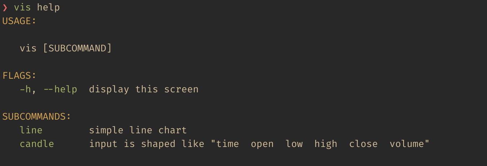

# case help generator esac

you have this
```
#!/bin/sh

case $1 in

	(-h|--help)  # display this screen
		usage; exit 0;;

	(line)       # simple line chart
		gnuplot -p -e '@png; plot "/dev/stdin" using 1:2 with lines' |
			open -a Preview -f
	;;

	(candle)     # input is shaped like "time  open  low  high  close  volume"
		gnuplot -p -e '@png; plot "/dev/stdin" using 1:2:3:4:5 with candlesticks' |
			open -a preview -f
	;;

	(*)
		usage; exit 1;;

esac
```

you want this

remember clap.rs?

solution is 706 bytes, add this burger to the top
```sh
#=-------=# case-esac based help screen generator for shell scripts #=-------=#
p(){ printf "$@";};e=$(p '\033');G="${e}[32m";Y="${e}[33m";R="${e}[0m";I="   ";
    g(){ grep "$@";};t(){ p "%b$1:%b\n" "$Y" "$R";}; i(){ p "$I";};usage(){
      >&2 t "USAGE";echo;i; >&2 p "%b [SUBCOMMAND]\n\n" "$(basename "$0")"
   >&2 t "FLAGS";sed -n '/case $[0-9] in/,$p' "$0"|g '([^)]*)'|g '(\-\|(\--'|
sed "/(\*)/d;s/\t/${I}/g;s/ #\([^#]*\)/\1/g;s/|/$R, $G/g;s/(/$G/g;s/)/$R/g";echo
 >&2 t "SUBCOMMANDS";sed -n '/case $[0-9] in/,$p' "$0"|g '([^)]*)'|g -v '(\-'|
     sed "/(\*)/d;s/\t/${I}/g"|sed "s/#\([^#]*\)/\1/g;s/(/$G/g;s/)/$R/g";}
#=-----------------------=# like a vegan burger huh #=-----------------------=#
```

## notes

- you should use two parentheses for case switches like `(help) usage; exit
  1;;`.
